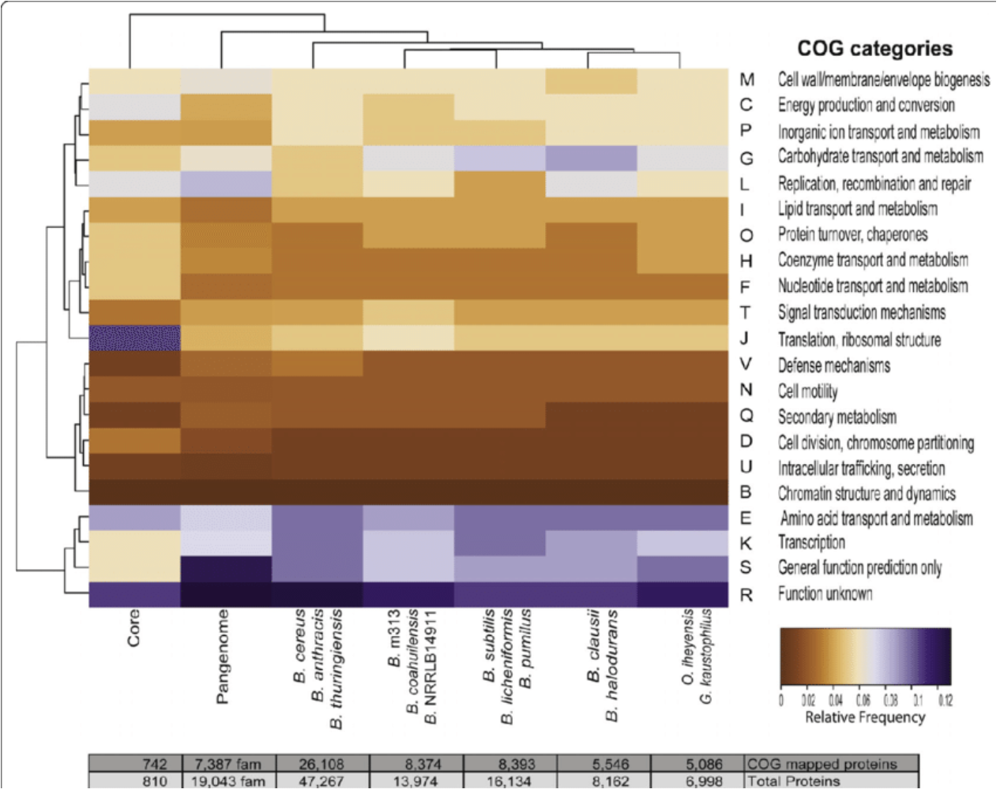

title: "SAR11 Protein Comparison"
date: "2023-05-09"
output:
  html_document:
    theme: cosmo
    highlight: pygments
    toc: true
    toc_float: true
    toc_depth: 2
    code_folding: show
---


# Project Information
SAR11 is a group of small, carbon-oxidizing bacteria that reach a global estimated population size of 2.4×1028 cells-approximately 25% of all plankton. They play a key role in the ocean's environment.

# Objective

- Comparative genomics project to identify presence and absence of SAR11 genomes

- Genomes obtained from NCBI database

# Workflow:

1. Data acquisition from NCBI database

2. Genome assembly and quality assessment

3. Comparative analysis of SAR11 genomes

4. Visualization 

The BLASTing of the reference genome was done in another file. The URL is attached here to peruse for a more step by step flow. 

RPubs Link: https://rpubs.com/sggarcia6/1039843


# Goal for the final figure:

Goal for the final figure.


# Workflow for other genomes

RPubs Link for Euryarchaeota: https://rpubs.com/sggarcia6/1042560


# Load your libraries
```{r setup, include = FALSE}
library(knitr)
library(tidyverse)
library(kableExtra)
library(DT)
library(reshape2)
library(Biostrings)
library(tm)
library(ggplot2)
library(dplyr)
library(gridExtra)
```

# BLAST Comparison of 45 (HTCC1062) to others.

Having the comparison of 45 to 95 into a CSV file.
```{r, eval=TRUE}
# Read out the blast file into csv
bltabl1 <- read.csv("../output/45-95_blastp.tab", sep = '\t', header = FALSE)


#Extract columns desired
 bltabl1_2.0 <- bltabl1[, c("V1", "V2", "V11", "V12")]

#Make into dataframe

bltabl1_2.0_df <- data_frame(bltabl1_2.0)

colnames(bltabl1_2.0_df) <- c("Query", "Database", "Eval", "Score")
```

Having the comparison of 45 to GCA_012276695.1(also known as NP1) into a CSV file.
```{r, eval=TRUE}
# Read out the blast file into csv
bltabl2 <- read.csv("../output/45-NP1_blastp.tab", sep = '\t', header = FALSE)


#Extract columns desired
 bltabl2_2.0 <- bltabl2[, c("V1", "V2", "V11", "V12")]

#Make into dataframe

bltabl2_2.0_df <- data_frame(bltabl2_2.0)

colnames(bltabl2_2.0_df) <- c("Query", "Database", "Eval", "Score")
```

Having the comparison of 45 to GCA_000155895 into a CSV file.  (HTCC7211)
```{r, eval=TRUE}
# Read out the blast file into csv
bltabl3 <- read.csv("../output/bigblast-01/GCA_000155895.1_45_blastp.tab", sep = '\t', header = FALSE)


#Extract columns desired
 bltabl3_2.0 <- bltabl3[, c("V1", "V2", "V11", "V12")]

#Make into dataframe

bltabl3_2.0_df <- data_frame(bltabl3_2.0)

colnames(bltabl3_2.0_df) <- c("Query", "Database", "Eval", "Score")
```

Having the comparison of 45 to GCA_002101295 into a CSV file. (Alphaproteobacteria	RS40)
```{r, eval=TRUE}
# Read out the blast file into csv
bltabl4 <- read.csv("../output/bigblast-01/GCA_002101295.1_45_blastp.tab", sep = '\t', header = FALSE)


#Extract columns desired
 bltabl4_2.0 <- bltabl4[, c("V1", "V2", "V11", "V12")]

#Make into dataframe

bltabl4_2.0_df <- data_frame(bltabl4_2.0)

colnames(bltabl4_2.0_df) <- c("Query", "Database", "Eval", "Score")
```

Having the comparison of 45 to GCA_028230015.1 into a CSV file. (AM-375-I16)
```{r, eval=TRUE}
# Read out the blast file into csv
bltabl5 <- read.csv("../output/bigblast-01/GCA_028230015.1_45_blastp.tab", sep = '\t', header = FALSE)


#Extract columns desired
 bltabl5_2.0 <- bltabl5[, c("V1", "V2", "V11", "V12")]

#Make into dataframe

bltabl5_2.0_df <- data_frame(bltabl5_2.0)

colnames(bltabl5_2.0_df) <- c("Query", "Database", "Eval", "Score")
```

Having the comparison of 45 to GCA_028229715.1 into a CSV file. (AM-375-K20)
```{r, eval=TRUE}
# Read out the blast file into csv
bltabl6 <- read.csv("../output/bigblast-01/GCA_028229715.1_45_blastp.tab", sep = '\t', header = FALSE)


#Extract columns desired
 bltabl6_2.0 <- bltabl6[, c("V1", "V2", "V11", "V12")]

#Make into dataframe

bltabl6_2.0_df <- data_frame(bltabl6_2.0)

colnames(bltabl6_2.0_df) <- c("Query", "Database", "Eval", "Score")
```

# Reading the file from 45 protein to CSV file.
```{r, eval=TRUE}
spgo <- read.csv("../output/45protein.tab", sep = '\t', header = TRUE)
colnames(spgo) <- c("Database", "Protein", "Coding_Sequence")
```

# Tables for each comparison
45 to 95
```{r, eval=TRUE}
# Join the data frames
joined1_df <- left_join(bltabl1_2.0_df, spgo, by = c("Database" = "Database")) %>%
  mutate(Organism = "sar95")

# You may print the table with kable
#kable(head(joined1_df, n = 10), caption = "Joined data frame with kable formatting (first 10 rows)") 

#Scrollable tables
datatable(head(joined1_df), options = list(scrollX = TRUE, scrollY = "400px", scrollCollapse = TRUE, paging = FALSE))  
```
45 to GCA_012276695.1
```{r, eval=TRUE}
# Join the data frames
joined2_df <- left_join(bltabl2_2.0_df, spgo, by = c("Database" = "Database")) %>%
  mutate(Organism = "NP1")

# You may print the table with kable
#kable(head(joined2_df, n = 10), caption = "Joined data frame with kable formatting (first 10 rows)") 

#Scrollable tables
datatable(head(joined2_df), options = list(scrollX = TRUE, scrollY = "400px", scrollCollapse = TRUE, paging = FALSE)) 
```
45 to GCA_000155895.1
```{r, eval=TRUE}
# Join the data frames
joined3_df <- left_join(bltabl3_2.0_df, spgo, by = c("Database" = "Database")) %>%
  mutate(Organism = "HTCC711")

# You may print the table with kable
#kable(head(joined3_df, n = 10), caption = "Joined data frame with kable formatting (first 10 rows)") 

#Scrollable tables
datatable(head(joined3_df), options = list(scrollX = TRUE, scrollY = "400px", scrollCollapse = TRUE, paging = FALSE))  
```
45 to GCA_002101295.1
```{r, eval=TRUE}
# Join the data frames
joined4_df <- left_join(bltabl4_2.0_df, spgo, by = c("Database" = "Database")) %>%
  mutate(Organism = "RS40")

#You may print the table with kable
#kable(head(joined4_df, n = 10), caption = "Joined data frame with kable formatting (first 10 rows)") 

#Scrollable tables
datatable(head(joined4_df), options = list(scrollX = TRUE, scrollY = "400px", scrollCollapse = TRUE, paging = FALSE))   
```
45 to GCA_028230015.1
```{r, eval=TRUE}
# Join the data frames
joined5_df <- left_join(bltabl5_2.0_df, spgo, by = c("Database" = "Database")) %>%
  mutate(Organism = "AM-375-I16")

# You may print the table with kable
#kable(head(joined5_df, n = 10), caption = "Joined data frame with kable formatting (first 10 rows)") 

#Scrollable tables
datatable(head(joined5_df), options = list(scrollX = TRUE, scrollY = "400px", scrollCollapse = TRUE, paging = FALSE)) 
  
```
45 to GCA_028229715.1
```{r, eval=TRUE}
# Join the data frames
joined6_df <- left_join(bltabl6_2.0_df, spgo, by = c("Database" = "Database")) %>%
  mutate(Organism = "AM-375-K20")

# You may print the table with kable
#kable(head(joined6_df, n = 10), caption = "Joined data frame with kable formatting (first 10 rows)") 

#Scrollable tables
datatable(head(joined6_df), options = list(scrollX = TRUE, scrollY = "400px", scrollCollapse = TRUE, paging = FALSE)) 
```
# Joining all Datatables 
```{r, eval=TRUE}
# Join the data frames
joinedtotal_df <- bind_rows(joined1_df, joined2_df, joined3_df, joined4_df, joined5_df, joined6_df)

#You may print the table with kable
#kable(head(joinedtotal_df, n = 10), caption = "Joined data frame with kable formatting (first 10 rows)") 

#Scrollable tables
datatable(head(joinedtotal_df), options = list(scrollX = TRUE, scrollY = "400px", scrollCollapse = TRUE, paging = FALSE)) 
```

# Two different Heatmaps
## Main HeatMap
```{r, eval=TRUE}
# Summarize the data
summarized_df <- joinedtotal_df %>%
  group_by(Protein, Organism) %>%
  summarize(mean_value = mean(Score))

# Create a wide-format table
wide_df <- summarized_df %>%
  pivot_wider(names_from = Organism, values_from = mean_value)

# Exclude non-numeric columns
data_mat <- as.matrix(wide_df[, -1])

# Handle missing, infinite, and NaN values
data_mat[is.na(data_mat)] <- 0  # Replace missing values with 0 or use appropriate imputation method
data_mat[!is.finite(data_mat)] <- 0  # Replace infinite and NaN values with 0 or other appropriate values

# Define custom color palette
my_palette <- colorRampPalette(c("darkblue", "white", "darkred"))(n = 100)

# Increase figure size and adjust margins
options(repr.plot.width = 10, repr.plot.height = 6)
par(mar = c(6, 4, 3, 2))

# Generate the heatmap with custom colors, row names, dendrograms, and color legend
heatmap(data_mat, Rowv = TRUE, Colv = TRUE, col = my_palette, scale = "column",
        labRow = wide_df$Protein, cex.lab = 0.6, cex.axis = 0.6, cex.main = 0.9,
        main = "Heatmap of Protein Expression",
        xlab = "Organism")

# Add color legend
legend("bottomleft", legend = c("Low", "Medium", "High"), fill = my_palette[seq(1, 100, length.out = 3)],
       bty = "n", cex = 0.8)

# Adjust plot margins
par(mar = c(6, 4, 3, 2))

```
## Initial Basic HeatMap 
```{r, eval=TRUE}
# Summarize the data
summarized_df <- joinedtotal_df %>%
  group_by(Protein, Organism) %>%
  summarize(mean_value = mean(Score))

# Create a wide-format table
wide_df <- summarized_df %>%
  pivot_wider(names_from = Organism, values_from = mean_value)

# Exclude non-numeric columns
data_mat <- as.matrix(wide_df[, -1])

# Define custom color palette
my_palette <- colorRampPalette(c("orange", "purple", "white"))(n = 100)

# Generate the heatmap with custom colors and row names
heatmap(data_mat, Rowv = NA, Colv = NA, col = my_palette, scale = "column",
        labRow = wide_df$Protein)
```

# Key Findings

-  Compare protein expression levels across different organisms, where higher expression levels are represented by warmer colors (e.g., red) and lower expression levels by cooler colors (e.g., blue).

## HeatMap comparing 4 with the top ten
```{r, eval=TRUE}
# Summarize the data
summarized_df <- joinedtotal_df %>%
  group_by(Protein, Organism) %>%
  summarize(mean_value = mean(Score)) %>%
  ungroup()

# Sort the summarized data by mean_value in descending order
summarized_df <- summarized_df %>%
  arrange(desc(mean_value))

# Select the top ten proteins
top_ten_proteins <- summarized_df$Protein[1:10]

# Filter the wide-format table to include only the top ten proteins
filtered_df <- wide_df %>%
  filter(Protein %in% top_ten_proteins)

# Exclude non-numeric columns
data_mat <- as.matrix(filtered_df[, -1])

# Define custom color palette
my_palette <- colorRampPalette(c("orange", "purple", "pink"))(n = 100)

# Increase figure size
options(repr.plot.width = 8, repr.plot.height = 6)

# Generate the heatmap with custom colors and row names
heatmap(data_mat, Rowv = NA, Colv = NA, col = my_palette, scale = "column",
        labRow = filtered_df$Protein, cex.lab = 0.8, cex.axis = 0.8, cex.main = 0.9, main = "Heatmap with Top 10 Protein hits",
        border = "black")  # Set border color to black

# Add color legend
legend("left", legend = c("Low", "Medium", "High"), fill = my_palette[seq(1, 100, length.out = 3)],
       bty = "n", cex = 0.8)

# Adjust plot margins
par(mar = c(5, 4, 2, 1))

```

# Top ten protein hits for all joined datasets

## Combination of 6 figures of Protein Hits
```{r, eval=TRUE}

# Create a list to store the data frames for each figure
top_10_strings_list <- list()

# Loop through each figure
for (i in 1:6) {
  # Read joined blast table with annotation table
  joined_df <- left_join(get(paste0("bltabl", i, "_2.0_df")), spgo, by = "Database")
  
  # Select the column of interest
  column_name <- "Protein"  # Replace with the name of the column of interest
  column_data <- joined_df[[column_name]]
  
  # Count the occurrences of the strings in the column
  string_counts <- table(column_data)
  
  # Convert to a data frame, sort by count, and select the top 10
  string_counts_df <- as.data.frame(string_counts)
  colnames(string_counts_df) <- c("String", "Count")
  string_counts_df <- string_counts_df[order(string_counts_df$Count, decreasing = TRUE), ]
  top_10_strings <- head(string_counts_df, n = 10)
  
  # Store the top 10 strings data frame in the list
  top_10_strings_list[[i]] <- top_10_strings
}

# Combine all data frames into one data frame
combined_data <- do.call(rbind, top_10_strings_list)

# Create a new column to identify the figure number
combined_data$Figure <- rep(1:6, each = 10)

# Increase figure size
options(repr.plot.width = 10, repr.plot.height = 6)

# Plot the combined data using facet_wrap()
ggplot(combined_data, aes(x = reorder(String, -Count), y = Count, fill = String)) +
  geom_bar(stat = "identity", position = "dodge", color = "black") +
  labs(title = "Top 10 Protein hits",
       x = column_name,
       y = "Count") +
  theme_minimal() +
  theme(legend.position = "none",
        axis.text = element_text(size = 5),  # Adjust text size for axis labels
        axis.title = element_text(size = 10),  # Adjust text size for axis titles
        plot.title = element_text(size = 12)) +  # Adjust text size for plot title
  coord_flip() +
  facet_wrap(~ Figure, ncol = 3)
```


Joined Dataset 1 
```{r, eval=TRUE}
# Read joined blast table with annotation table
joined1_df <- left_join(bltabl1_2.0_df, spgo, by = "Database")
#c("Database" = "Database"))

# Select the column of interest
column_name <- "Protein"  # Replace with the name of the column of interest
column_data <- joined1_df[[column_name]]

# Count the occurrences of the strings in the column
string_counts <- table(column_data)

# Convert to a data frame, sort by count, and select the top 10
string_counts_df <- as.data.frame(string_counts)
colnames(string_counts_df) <- c("String", "Count")
string_counts_df <- string_counts_df[order(string_counts_df$Count, decreasing = TRUE), ]
top_10_strings <- head(string_counts_df, n = 10)

# Plot the top 10 most common strings using ggplot2
ggplot(top_10_strings, aes(x = reorder(String, -Count), y = Count, fill = String)) +
  geom_bar(stat = "identity", position = "dodge", color = "black") +
  labs(title = "Top 10 Protein hits",
       x = column_name,
       y = "Count") +
  theme_minimal() +
  theme(legend.position = "none") +
  coord_flip()

```

Joined Dataset 2
```{r, eval=TRUE}
# Read joined blast table with annotation table
joined2_df <- left_join(bltabl2_2.0_df, spgo, by = "Database")
#c("Database" = "Database"))

# Select the column of interest
column_name <- "Protein"  # Replace with the name of the column of interest
column_data <- joined2_df[[column_name]]

# Count the occurrences of the strings in the column
string_counts <- table(column_data)

# Convert to a data frame, sort by count, and select the top 10
string_counts_df <- as.data.frame(string_counts)
colnames(string_counts_df) <- c("String", "Count")
string_counts_df <- string_counts_df[order(string_counts_df$Count, decreasing = TRUE), ]
top_10_strings <- head(string_counts_df, n = 10)

# Plot the top 10 most common strings using ggplot2
ggplot(top_10_strings, aes(x = reorder(String, -Count), y = Count, fill = String)) +
  geom_bar(stat = "identity", position = "dodge", color = "black") +
  labs(title = "Top 10 Protein hits",
       x = column_name,
       y = "Count") +
  theme_minimal() +
  theme(legend.position = "none") +
  coord_flip()

```

Joined Dataset 3
```{r, eval=TRUE}
# Read joined blast table with annotation table
joined3_df <- left_join(bltabl3_2.0_df, spgo, by = "Database")
#c("Database" = "Database"))

# Select the column of interest
column_name <- "Protein"  # Replace with the name of the column of interest
column_data <- joined3_df[[column_name]]

# Count the occurrences of the strings in the column
string_counts <- table(column_data)

# Convert to a data frame, sort by count, and select the top 10
string_counts_df <- as.data.frame(string_counts)
colnames(string_counts_df) <- c("String", "Count")
string_counts_df <- string_counts_df[order(string_counts_df$Count, decreasing = TRUE), ]
top_10_strings <- head(string_counts_df, n = 10)

# Plot the top 10 most common strings using ggplot2
ggplot(top_10_strings, aes(x = reorder(String, -Count), y = Count, fill = String)) +
  geom_bar(stat = "identity", position = "dodge", color = "black") +
  labs(title = "Top 10 Protein hits",
       x = column_name,
       y = "Count") +
  theme_minimal() +
  theme(legend.position = "none") +
  coord_flip()

```

Joined Dataset 4
```{r, eval=TRUE}
# Read joined blast table with annotation table
joined4_df <- left_join(bltabl4_2.0_df, spgo, by = "Database")
#c("Database" = "Database"))

# Select the column of interest
column_name <- "Protein"  # Replace with the name of the column of interest
column_data <- joined4_df[[column_name]]

# Count the occurrences of the strings in the column
string_counts <- table(column_data)

# Convert to a data frame, sort by count, and select the top 10
string_counts_df <- as.data.frame(string_counts)
colnames(string_counts_df) <- c("String", "Count")
string_counts_df <- string_counts_df[order(string_counts_df$Count, decreasing = TRUE), ]
top_10_strings <- head(string_counts_df, n = 10)

# Plot the top 10 most common strings using ggplot2
ggplot(top_10_strings, aes(x = reorder(String, -Count), y = Count, fill = String)) +
  geom_bar(stat = "identity", position = "dodge", color = "black") +
  labs(title = "Top 10 Protein hits",
       x = column_name,
       y = "Count") +
  theme_minimal() +
  theme(legend.position = "none") +
  coord_flip()

```

Joined Dataset 5
```{r, eval=TRUE}
# Read joined blast table with annotation table
joined5_df <- left_join(bltabl5_2.0_df, spgo, by = "Database")
#c("Database" = "Database"))

# Select the column of interest
column_name <- "Protein"  # Replace with the name of the column of interest
column_data <- joined5_df[[column_name]]

# Count the occurrences of the strings in the column
string_counts <- table(column_data)

# Convert to a data frame, sort by count, and select the top 10
string_counts_df <- as.data.frame(string_counts)
colnames(string_counts_df) <- c("String", "Count")
string_counts_df <- string_counts_df[order(string_counts_df$Count, decreasing = TRUE), ]
top_10_strings <- head(string_counts_df, n = 10)

# Plot the top 10 most common strings using ggplot2
ggplot(top_10_strings, aes(x = reorder(String, -Count), y = Count, fill = String)) +
  geom_bar(stat = "identity", position = "dodge", color = "black") +
  labs(title = "Top 10 Protein hits",
       x = column_name,
       y = "Count") +
  theme_minimal() +
  theme(legend.position = "none") +
  coord_flip()

```

Joined Dataset 6
```{r, eval=TRUE}
# Read joined blast table with annotation table
joined6_df <- left_join(bltabl6_2.0_df, spgo, by = "Database")
#c("Database" = "Database"))

# Select the column of interest
column_name <- "Protein"  # Replace with the name of the column of interest
column_data <- joined6_df[[column_name]]

# Count the occurrences of the strings in the column
string_counts <- table(column_data)

# Convert to a data frame, sort by count, and select the top 10
string_counts_df <- as.data.frame(string_counts)
colnames(string_counts_df) <- c("String", "Count")
string_counts_df <- string_counts_df[order(string_counts_df$Count, decreasing = TRUE), ]
top_10_strings <- head(string_counts_df, n = 10)

# Plot the top 10 most common strings using ggplot2
ggplot(top_10_strings, aes(x = reorder(String, -Count), y = Count, fill = String)) +
  geom_bar(stat = "identity", position = "dodge", color = "black") +
  labs(title = "Top 10 Protein hits",
       x = column_name,
       y = "Count") +
  theme_minimal() +
  theme(legend.position = "none") +
  coord_flip()
```
